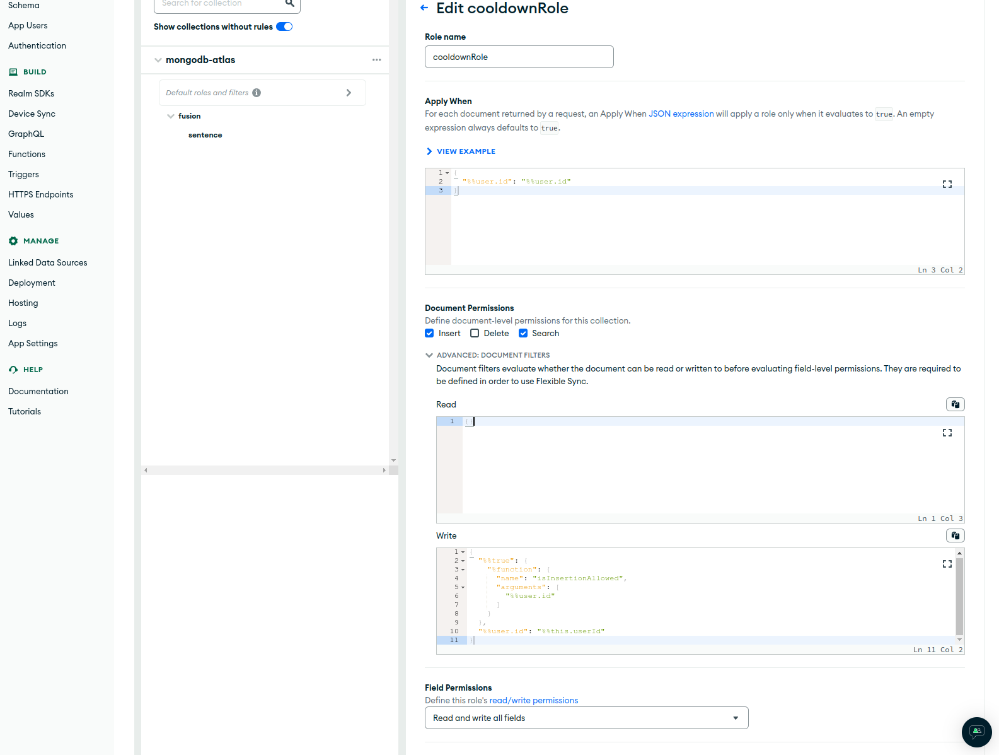

# Exploring MongoDB App Services

> Warning! This tutorial will involve serverless functions, Atlas Realm and making an exciting project.

> For now basic MongoDB knowledge is assumed. The tutorial will be updated to be more beginner friendly later.

---

## Introduction

* ## What are serverless functions?

    Serverless functions, also known as Function as a Service (FaaS), are a type of cloud computing service that allows developers to run and execute code without the need to manage or provision servers. In a traditional server-based model, developers have to set up and manage servers to host their applications and handle incoming requests. With serverless functions, developers can focus solely on writing and deploying code without worrying about the underlying infrastructure.

    Benefits:

    - **No infrastructure necessary** - in a serverless architecture, the cloud provider takes care of managing the servers
    - **Pay for exact usage** - billing is typically based on the actual execution time and resource usage
    - **Autoscaling** - the serverless platform automatically scales up the necessary resources to handle the incoming request
    - **Multiple triggers** - functions are triggered by events, such as HTTP requests, database updates, file uploads, timers, or messages from queues

* ## What is MongoDB Atlas Realm?

    MongoDB Atlas Realm is a cloud-based serverless platform provided by MongoDB. It is designed to simplify the development and deployment of real-time applications that require data synchronization and event-driven workflows.

    Key features:

    - Real-Time Data Sync
    - Authentication and User Management
    - Serverless Functions
    - Integration with MongoDB Atlas
    - GraphQL API
    - Multiple SDKs

---

## Project - part 1

### Goal

Create an application that will allow user creation. Created users will be able to participate in writing a story. There will be one rule: a single user can't write two sentences in a row - that ensures that at least two people will be writing a story. Later we will also create a public endpoint that will return number of created sentences.

Our task is to properly configure MongoDB to make it work. Let's do it.

### Setup

Login to MongoDB Atlas and create a new project. When creating a new free-tier cluster: choose a nearby location, create a new user and **set access to anywhere (0.0.0.0/0)**. Inside the cluster create a database named ***fusion*** with a collection named ***sentence***.

### Configuring a Realm App

Head to the **App Services** tab on the upper panel.


We will begin by adding user authentication configuration.


For now users won't be able to reset their passwords but a reset function must exist. We will **go with the default password reset function, without any changes**.


When you are done click *Save draft* button at the bottom. When you do changes won't be instantly deployed until you click *Review draft & deploy* button, then you get a chance to review all changes and deploy them.

Let's create a function that we will use in a rule later. This function will be responsible for determining if a user can insert a new document.

Enter function list view from the left side panel. You should see resetFunc created earlier. Click *Create New Function*.


In the *Settings* tab begin configuration:


Authentication **System** will allow the function to execute with full priviliges and setting it to private will make it unreachable for regular users. We configure it that way because the only user of this function will be our rule.

Now set head to *Function Editor* and write the following code:

```js
exports = async function(arg){
  const mongodb = context.services.get("mongodb-atlas");
  const db = mongodb.db("fusion");
  const coll = db.collection("sentence");
  
  const latestDocument = await coll.find().sort({_id: -1}).limit(1).toArray();
  if(latestDocument.length == 0) return true;

  return latestDocument[0].userId != arg;
};
```


Remember to save draft changes.

Now let's configure our rule. Go to *Rules* view on the left side panel.


Select sentence collection, then click blue *Skip (start from scratch)* text to create a fully customized rule. Fill settings with this configuration.



In the *Apply When* you can place any JSON expression that will always evaluate to true. In the write document permission we set the rule to use our function to decide, whether a document should be inserted. Learn more about [Rule Expressions](https://www.mongodb.com/docs/atlas/app-services/rules/expressions/).

```json
{
  "%%true": {
    "%function": {
      "name": "isInsertionAllowed",
      "arguments": [
        "%%user.id"
      ]
    }
  },
  "%%user.id": "%%this.userId"
}
```

The *Write* advanced filter will call our previously created function. The function will return whether the user's insertion request will be accepted. The second condition makes it unable for the user to provide a different userId that their actual. If a user attempts to insert a document with userId "a", it will be rejected.

After you are done with that, deploy your changes.

Go to *App Users* on the left side panel and add two users with any email and password. The email doesn't matter since we won't be verifying it anyway.

### Writing web application

For writing a web app, we will need a web SDK. The SDK is hosted on a CDN under the following address: [https://unpkg.com/realm-web/dist/bundle.iife.js](https://unpkg.com/realm-web/dist/bundle.iife.js).

We won't be writing the web app though. The only important thing in the [adder.html](./adder.html) is the following part (you should change the id from *appliaction* to the one, that you get when pressing the copy button, in the upper left corner near the name of your Realm app and the home icon):

```js
const app = new Realm.App({ id: "application" });

async function loginEmailPassword(email, password) {
    const credentials = Realm.Credentials.emailPassword(email, password);
    const user = await app.logIn(credentials);
    console.assert(user.id === app.currentUser.id);
    return user;
}
```

This code logs into Realm SDK application with user credentials and then you are allowed to perform standard operations. Of course our rules should disallow a signle user to post two consecutive sentences in a row. Use [adder.html](./adder.html) to test if your configuration is working properly with two different users you created.

---

## Project - part 2

### Task

Set up a function that returns count of sentences. Return the number as a string in a JSON, like: **{ number: ... }**. Use the same function settings and name it *sentenceCount*.

*Hint*: use testing console below to run the function and check its output, you can also perform *console.log*.

<details>
    <summary>Code Solution</summary>

```js
exports = async function(arg){
  const mongodb = context.services.get("mongodb-atlas");
  const db = mongodb.db("fusion");
  const coll = db.collection("sentence");
  
  return { number: String(await coll.count()) };
};
```

</details>

<br />

### Setting a trigger

In the beginning you learned that these functions can be executed on various triggers. Rules aren't the only possibility. Let's set up a HTTPS endpoint.


Our endpoint will be for GET requests and it will respond with JSON result. Here you should copy the second URL under the *Operation Type* as later we will use it to test the endpoint.


In the *Function* option select the function that you created earlier in the task. As you can see endpoints can be also used for user creation.


After deployment, use the copied curl command to check if your endpoint returns a JSON with appropriate sentence count.

---

## Project - part 3

There is one more configuration left - document validation. We will use MongoDB Compass for that. Before we begin ensure that, user you use to access database from Compass, has **Atlas Admin** role. It is required to create validation rule.


Log into your cluster, go to *fusion* database, *sentence* collection and then to **Validation** tab.


Set the following rule, with *Validation Action* set to **Error** and *Validation Level* to **strict**:

```json
{
   "$jsonSchema":{
      "bsonType":"object",
      "required":[
         "_id",
         "userId",
         "content"
      ],
      "properties":{
         "_id":{
            "bsonType":"objectId"
         },
         "userId":{
            "bsonType":"string"
         },
         "content":{
            "bsonType":"string",
            "minLength":10,
            "maxLength":100
         }
      },
      "additionalProperties":false
   }
}
```


Now users will be unable to insert documents with redundant fields and sentence length will be limited. When they try to insert invalid document, they will encounter an error, preventing them.

---

